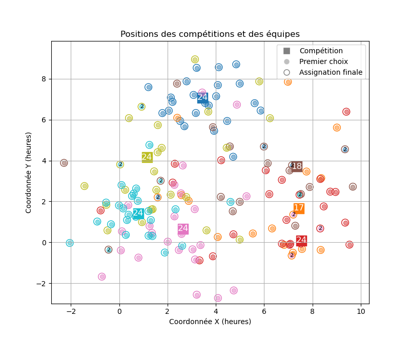

# Magouilleuse des compétitions FTC en France

La Magouilleuse des compétitions vise à assigner chaque équipe FTC française à une compétition de manière optimale. L'objectif étant de minimiser l'insatisfaction des équipes tout en prenant en compte les temps de trajet vers les compétitions.

## Fonctionnement

### Principes de base

La Magouilleuse est utilisée pour assigner à chaque équipe **une seule compétition** parmi celles disponibles. Si une équipe souhaite participer à plusieurs compétitions, elle pourra s'y inscrire par la suite, dans la limite des places disponibles.

La Magouilleuse doit respecter les contraintes suivantes :
1. Chaque équipe doit être assignée à une unique compétition.
2. Chaque compétition doit accueillir un nombre d'équipes compris entre 8 et 24.
3. L'insatisfaction des équipes doit être minimisée. L'algorithme doit assigner en priorité les équipes à leurs compétitions préférées
4. Les équipes souhaitant participer à une compétition proche de chez elles doivent être favorisées par rapport à celles souhaitant participer à une compétition plus éloignée.


### Implémentation des principes

On modélise le problème d'assignation à l'aide d'une matrice de coûts, où chaque élément représente le coût d'assigner une équipe à une compétition. Le coût est calculé en combinant l'insatisfaction de l'équipe pour la compétition et le temps de trajet vers la compétition.

Identifions par
 * $i \in \{1, \ldots, n\}$ les $n$ équipes
 * $j \in \{1, \ldots, m\}$ les $m$ compétitions

Le coût d'assigner l'équipe $i$ à la compétition $j$ est donné par $c_{ij}$. Et le but est de determiner une matrice d'assignation optimale $X$ de taille $n \times m$ où $x_{ij} = 1$ si l'équipe $i$ est assignée à la compétition $j$, et $0$ sinon, de manière à minimiser le coût total d'assignation.

Le problème d'optimisation peut être formulé de la manière suivante :

$$
\begin{aligned}
\underset{X \in \mathbb{R}^{n \times m}}{\text{minimiser}} \space &\sum_{i=1}^{n} \sum_{j=1}^{m} c_{ij} x_{ij} \\
\text{tel que } &\begin{cases}
\sum_{j=1}^{m} x_{ij} = 1 & \forall i \\
8 \leq \sum_{i=1}^{n} x_{ij} \le 24 & \forall j \\
x_{ij} \in \{0, 1\} & \forall i, j
\end{cases}
\end{aligned}
$$

Ou sous forme matricielle :

$$
\begin{aligned}
\underset{X \in \mathbb{R}^{n \times m}}{\text{minimiser}} \space & \text{tr}( C^T X) \\
\text{tel que } &\begin{cases}
X \mathbf{1}_m = \mathbf{1}_n \\
8 \times \mathbf{1}_m \leq X^T \mathbf{1}_n \le 24 \times \mathbf{1}_m \\
X \in \{0, 1\}^{n \times m}
\end{cases}
\end{aligned}
$$

## Calcul du coût d'assignation

Le coût d'assignation $c_{ij}$ doit refleter les principes énoncés précédemment :

3. L'insatisfaction de l'équipe $i$ pour la compétition $j$
4. La proximité de la compétition $j$ par rapport à l'équipe $i$

### Insatisfaction

Chaque équipe classe les compétitions par ordre de préférence. L'insatisfaction est calculée en fonction du rang de la compétition dans la liste de préférences de l'équipe.
L'insatisfaction est donnée par la formule suivante :
$$\text{insatisfaction}(rang) = 2^{(rang - 1)}$$

> [!NOTE]
> Ainsi, chaque rang supplémentaire dans la liste de préférences double l'insatisfaction, ce qui décourage très fortement l'assignation à des compétitions en fin de liste.
>
> | Rang de préférence | Insatisfaction |
> |--------------------|----------------|
> | 1                  | 1              |
> | 2                  | 2              |
> | 3                  | 4              |
> | 4                  | 8              |
>
> Cela signifie que les échanges suivants donnent des insatisfactions globales identiques :
>
> | Équipe A | Autres équipes |
> |----------|----------------|
> | Voeu 1 -> voeu 2 | Une autre équipe passe de son voeu 2 à son voeu 1 |
> | Voeu 2 -> voeu 3 | **2 autres équipes** passent de leur voeu 2 à leur voeu 1 |
> | Voeu 3 -> voeu 4 | **4 autres équipes** passent de leur voeu 2 à leur voeu 1 |


### Proximité géographique

Le temps de trajet entre l'équipe et la compétition est également pris en compte dans le coût d'assignation. Il est calculé pour un trajet en voiture entre les villes d'origine des équipes et les villes hôtes des compétitions. Le temps de trajet est normalisé et intégré dans le coût d'assignation de manière à favoriser les compétitions plus proches.

La formule retenue pour la proximité est la suivante :
$$\text{proximité}(i, j) = 2^{- \frac{\text{temps de trajet}(i, j)}{\tau}}$$

Où $\tau$ est le temps choisi afin qu'ajouter $\tau$ heures de trajet divise la proximité par 2. Dans notre cas, nous avons choisi $\tau = 2 \text{h}$, ce qui signifie que chaque tranche de 2 heures de trajet réduit la proximité de moitié.

| Temps de trajet entre l'équipe $i$ et la compétition $j$ | Proximité |
|----------|----------------|
| 0h       | 1              |
| 2h       | 0.5            |
| 4h       | 0.25           |
| 6h       | 0.125          |

> [!NOTE]
> Ainsi, si toutes les équipes souhaitent participer à la même compétition, les équipes les plus proches seront favorisées par rapport à celles plus éloignées.

### Coût d'assignation

Le coût d'assignation $c_{ij}$ est calculé en combinant l'insatisfaction et la proximité de la manière suivante :
$$c_{ij} = \text{insatisfaction}(\text{rang}(i, j)) - \text{proximité}(i, j)$$

> [!NOTE]
> On s'assure que le score lié à la proximité ne peut différer que de 1 point d'une équipe à l'autre, ce qui garantit un bon comportement dans la situation suivante :
>
> * L'équipe A préfère la compétition 1 (plus éloignée) à la compétition 2 (plus proche)
> * L'équipe B préfère la compétition 2 (plus éloignée) à la compétition 1 (plus proche)
>
> La meilleure solution est ici d'assigner l'équipe A à la compétition 1 et l'équipe B à la compétition 2. Faire l'autre choix augmente l'insatisfaction de chaque équipe d'au moins 1 point, mais augmente aussi la proximité de chaque équipe. Si l'augmentation de la proximité est inférieur à 1 point, alors le choix optimal est d'assigner chaque équipe à sa compétition préférée, même si elle est plus éloignée.


## 

### Environnement de développement

Le projet utilise Python et plusieurs bibliothèques pour le traitement des données et la résolution du problème d'optimisation. Pour configurer l'environnement de développement, suivez les étapes ci-dessous :

```
$ conda env create -f environment.yml
$ conda activate magouilleuse
```

### Exécution du projet

Le fichier `test.py` contient un script de test qui génère des données aléatoires pour les équipes, les compétitions, les temps de trajet et les préférences des équipes. Il résout ensuite le problème d'assignation en utilisant l'algorithme de la Magouilleuse et affiche les résultats.

Pour exécuter le script de test, utilisez la commande suivante après avoir activé l'environnement de développement :

```
$ python test.py
```

Le script affichera les compétitions et les équipes sur une carte, avec chaque compétition représentée par un carré de couleur et les premiers voeux des équipes indiqués par des points de la même couleur.

La compétition à laquelle chaque équipe est assignée est indiquée par un cercle autour du point représentant l'équipe. Si une équipe n'est pas assignée à son premier voeu, un nombre indiquant le rang de la compétition à laquelle elle est assignée est affiché sur le cercle.

Le nombre d'équipes assignées à chaque compétition est également affiché en blanc sur le carré représentant la compétition.


